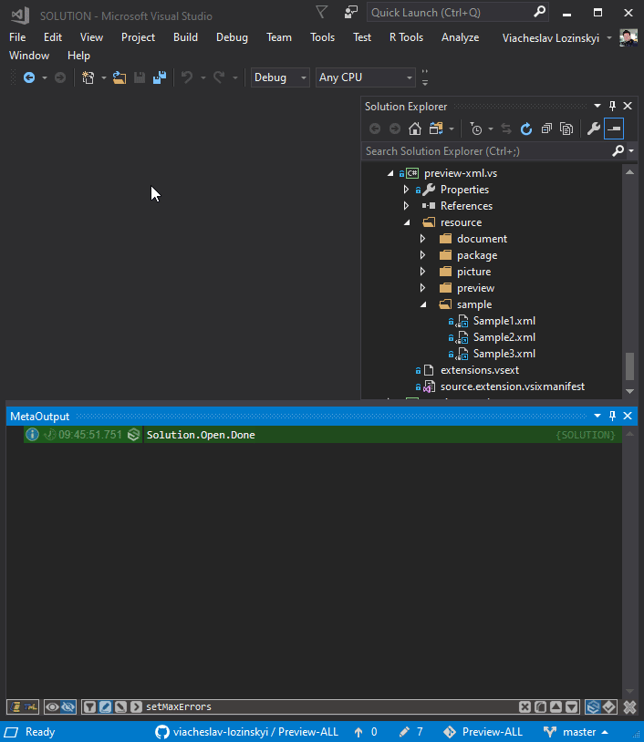

### Now you can look inside XML file not opening it.

Download the extension from the [Visual Studio Marketplace](https://marketplace.visualstudio.com/items?itemName=ViacheslavLozinskyi.Preview-XML)

Data visualization is based on <a href="https://marketplace.visualstudio.com/items?itemName=ViacheslavLozinskyi.MetaProject">MetaProject</a>
